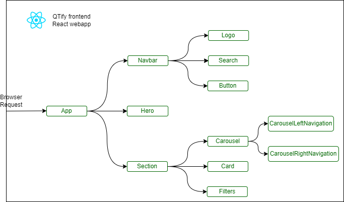
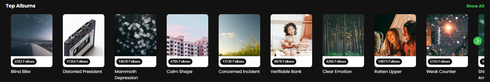
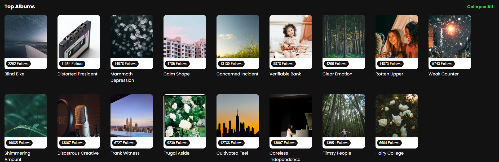

# Q-Tify React App

This project was bootstrapped with [Create React App](https://github.com/facebook/create-react-app).

## Requirements

QTify is a song-browsing application built from scratch using ReactJS paired with Material UI and Swiper to deliver a seamless and aesthetic user interface, offering songs from different albums and genres for music lovers.

### Skills used
ReactJS, Module-scoped CSS, Flexbox, CSS variables, JS

## Albums Section
Scope of work
Developed a dynamic, responsive, and reusable Card component with Material-UI integration, featuring custom CSS, efficient data handling, and enhanced user interaction through tooltips and lazy-loaded images.
Implemented and customized a carousel feature using the Swiper library and utilizing custom navigation.
Developed a dynamic Section component capable of dynamically displaying content in both carousel and grid layouts using conditional rendering.
### Skills used
ReactJS, Module-scoped CSS, Condition Rendering, Component Reusability, Swiper Library usage, Material UI, Customizing Third-Party Components

## Image(s)

### Top Albums Carousel View (Conditional Rendering)

### Top Albums Grid View (Conditional Rendering)

### Deployed:
Deployed the Qtify React app to Vercel by importing the project repository from GitHub.
[Link to Live Project](https://qtify-puce.vercel.app/)

